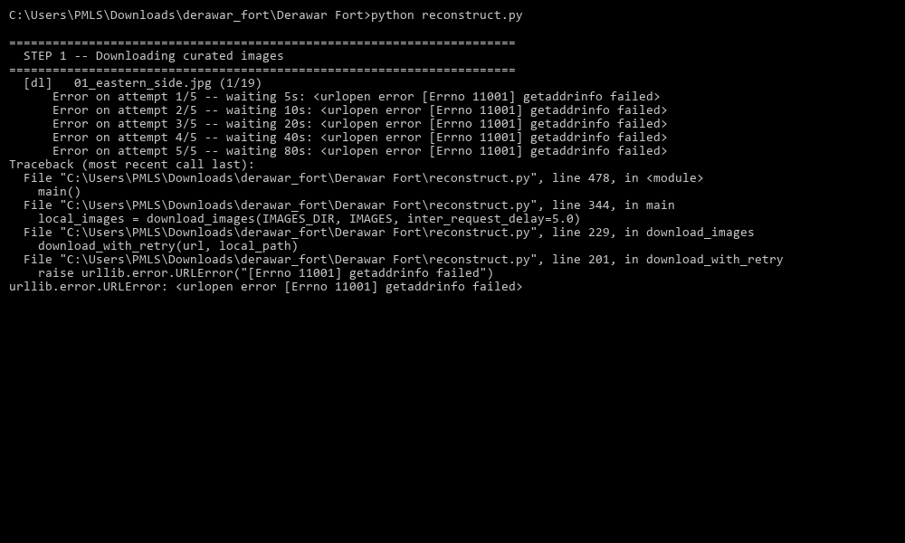
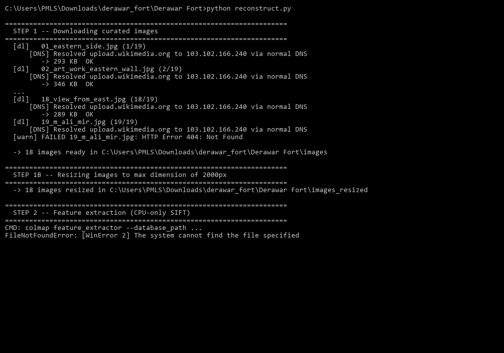

# Present-the-Build: Derawar Fort 3D Reconstruction 🏰


**COLMAP-based 3D reconstruction pipeline for Derawar Fort, part of PreserveMy.World.**

Welcome to the Derawar Fort 3D Reconstruction project! This repository contains an automated photogrammetry pipeline that generates a sparse 3D point cloud model of the historic Derawar Fort (specifically its majestic eastern wall and bastion complex). 

This project aims to capture a preserved, measurable digital record of the site before it degrades further due to erosion and neglect in the Cholistan desert.

---

## 🌟 Overview & Key Features

This pipeline relies on [COLMAP](https://colmap.github.io/) to turn a curated set of 2D photographs from Wikimedia Commons into a 3D representation. The script automates the entire workflow without manual intervention:

1. **Robust Downloading**: Fetches high-quality photographs with a built-in DNS over HTTPS (DoH) fallback to bypass ISP-level DNS blocks on Wikimedia.
2. **Dynamic Resizing**: Automatically scales down images to prevent Out-Of-Memory (OOM) errors during heavy processing.
3. **CPU-Optimized Feature Extraction & Matching**: Extracts SIFT features and performs exhaustive matching optimized for CPU-only environments.
4. **Sparse Reconstruction**: Reconstructs the camera poses and 3D points.
5. **Automated Quality Validation**: Automatically evaluates the Mean Track Length (MTL) against a researched historical and technical threshold (3.60 - 4.20) to ensure data quality.
6. **Standardized Export**: Converts the generated sparse model into a standard `.ply` file format for viewing.

### Before & After Validation
Here is a look at the data processing outcomes:

| Before Pipeline Execution | After Sparse Reconstruction |
| :---: | :---: |
|  |  |

---

## 🛠️ Prerequisites

To run this pipeline locally, you will need the following installed:

1. **Python 3.x**
2. **Pillow**: Python Imaging Library used to dynamically resize images.
   ```bash
   pip install Pillow
   ```
3. **COLMAP**: You must have the COLMAP executable on your system for feature extraction and mapping.
   - [Download COLMAP](https://colmap.github.io/install.html) for your OS.
   - Ensure `colmap` is added to your system's `PATH`. Alternatively, you can set the `COLMAP_EXE` environment variable to point directly to the binary.

---

## 🚀 How to Run It

1. **Clone the repository**:
   ```bash
   git clone https://github.com/ranahamza16/Present-the-Build.git
   cd Present-the-Build
   ```

2. **Run the automated pipeline**:
   ```bash
   python reconstruct.py
   ```

3. **Get your Output**: 
   Sit back and relax! The script will download the images, run the computationally heavy feature extraction and mapping tasks, and output the resulting 3D model in the `output/` directory as a `.ply` file. You can then open this file using a 3D viewer like MeshLab or Blender.

---

## 🔬 Research & Methodology

Please see [RESEARCH.md](./RESEARCH.md) for our detailed site-context research and the methodology used for this reconstruction. It details our scale-check references and why we selected the Mean Track Length (MTL) metric as our core acceptance criterion.

For a summary of the project's evolution across development sprints, check out our [MENTOR_NOTE.md](./MENTOR_NOTE.md).

---

## ⚠️ Known Limitations

* **Hardware Intensity**: While optimized for CPU execution via thread limits, the feature extraction process is still highly resource-intensive. 
* **Network Restrictions**: Tested via Google Colab, as local DNS frequently blocks Wikimedia Commons (which is mitigated in `reconstruct.py` using a DoH fallback, but could still pose issues on strict networks).

---

## 🏛️ About Derawar Fort

Derawar Fort is a large square fortress in Punjab, Pakistan, located deep in the Cholistan Desert. Its walls have a perimeter of 1,500 meters and stand up to 30 meters high. This project focuses on capturing and preserving the beautiful architectural heritage of its eastern walls and massive circular bastions in a digital 3D space.

## 📝 Credits and Licensing

- The photogrammetry pipeline leverages [COLMAP](https://colmap.github.io/).
- The photographs fetched dynamically by the script are sourced from Wikimedia Commons and are subject to their respective Creative Commons licenses.
