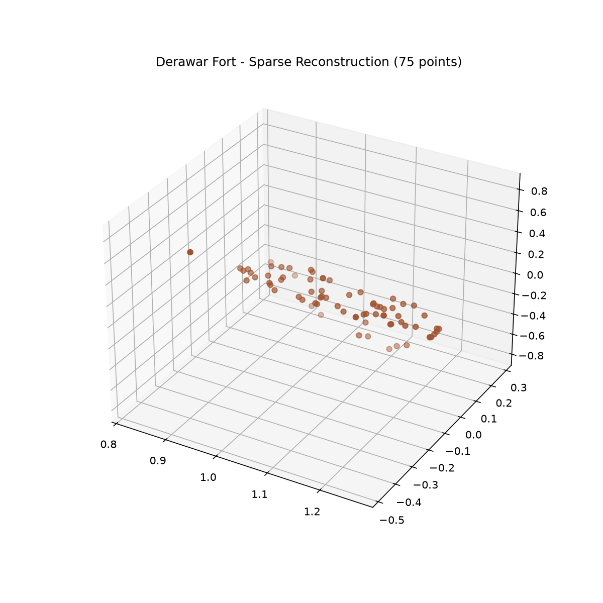

# 🏰 Derawar Fort 3D Sparse Reconstruction



Welcome to the **Derawar Fort 3D Reconstruction** project! This repository contains an automated pipeline to generate a sparse 3D point cloud model of the historic **Derawar Fort** (specifically its majestic eastern wall and bastion complex) using open-source photogrammetry tools.

## 🌟 Overview

This pipeline relies on **[COLMAP](https://colmap.github.io/)** to turn a curated set of 2D photographs from Wikimedia Commons into a 3D representation. The script automates the entire photogrammetry workflow, completely from scratch, without needing complex manual intervention!

The steps performed automatically by the pipeline include:
1. **Downloading Images:** Fetches a curated set of high-quality photographs from Wikimedia Commons.
2. **Resizing:** Scales down images to prevent memory issues during processing.
3. **Feature Extraction:** Extracts SIFT features from the images (CPU-only support built-in).
4. **Exhaustive Matching:** Matches the extracted features across all image pairs.
5. **Sparse Reconstruction (Mapping):** Reconstructs the 3D scene (camera poses and 3D points).
6. **Quality Validation:** Automatically checks the Mean Track Length (MTL) to evaluate the reconstruction quality against the 3.60-4.20 threshold.
7. **Exporting:** Converts the generated sparse model into a standard `.ply` file format for viewing.

## 🛠️ Prerequisites

To run this pipeline locally, you will need the following installed on your machine:

1. **Python 3.x**
2. **Pillow:** Python Imaging Library used to dynamically resize images.
   ```bash
   pip install Pillow
   ```
3. **COLMAP:** You need the COLMAP executable on your system. 
   - [Download COLMAP](https://colmap.github.io/install.html) for your operating system.
   - Ensure `colmap` is added to your system's `PATH`. Alternatively, you can set the `COLMAP_EXE` environment variable to point directly to the `colmap.exe` binary.

## 🚀 Usage

1. **Clone the repository:**
   ```bash
   git clone https://github.com/ranahamza16/Present-the-Build.git
   cd Present-the-Build
   ```

2. **Run the pipeline script:**
   ```bash
   python reconstruct.py
   ```

3. **Get Output:**
   Sit back and relax! The script will download the images, run the computationally heavy feature extraction and mapping tasks, and finally output the resulting 3D model in the `output/` directory as `derawar_fort_reconstruction.ply`. You can then open this file using a 3D viewer like MeshLab or Blender.

## 📂 Repository Contents

- `reconstruct.py` - The main Python pipeline script that orchestrates downloading, processing, and exporting the 3D model.
- `point_cloud_screenshot.png` - A preview image demonstrating the expected sparse 3D point cloud output.
- `output/` - Directory where the generated `.ply` reconstruction file will be stored.
- `images/` & `images_resized/` - (Generated during runtime) Used to store raw and resized photographs from Wikimedia.
- `sparse/` - (Generated during runtime) Used by COLMAP to store the sub-models.

## 🏛️ About Derawar Fort

Derawar Fort is a large square fortress in Punjab, Pakistan, located deep in the Cholistan Desert. Its walls have a perimeter of 1500 meters and stand up to 30 meters high. This project focuses on capturing and preserving the beautiful architectural heritage of its eastern walls and massive circular bastions in a digital 3D space.

## 📝 Credits and Licensing

- The photogrammetry pipeline leverages **COLMAP**.
- The photographs fetched dynamically by the script are sourced from **Wikimedia Commons** and are subject to their respective Creative Commons licenses.
